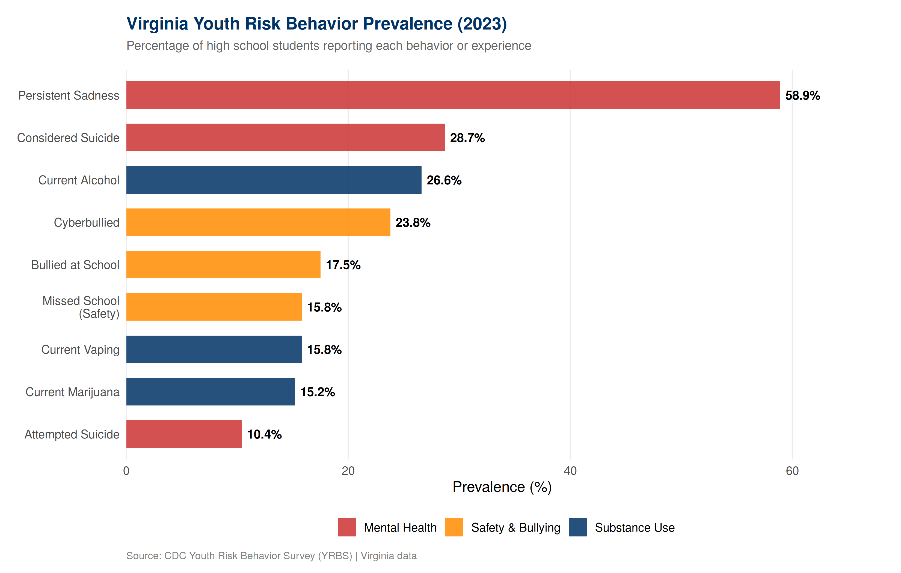
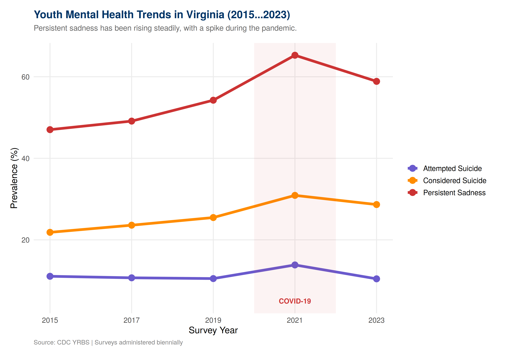
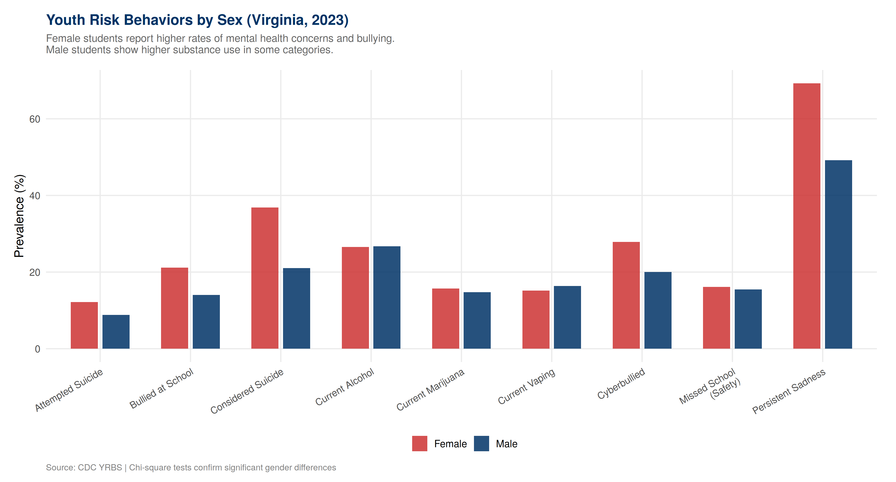
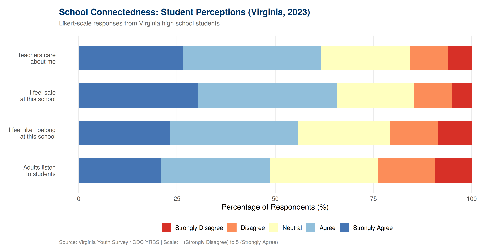
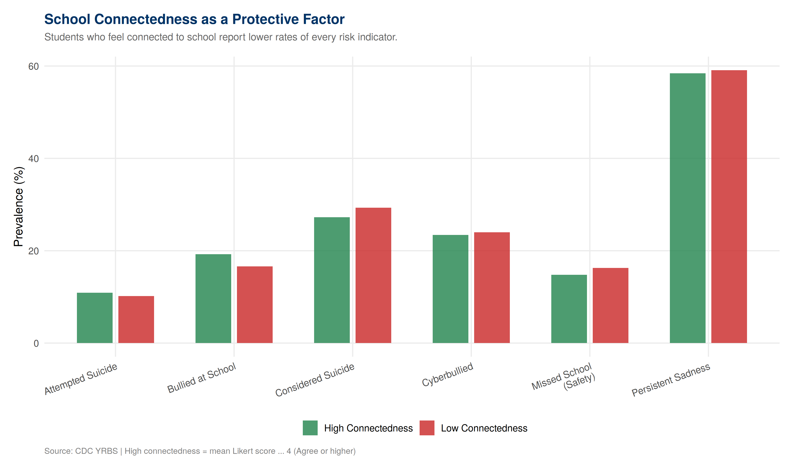
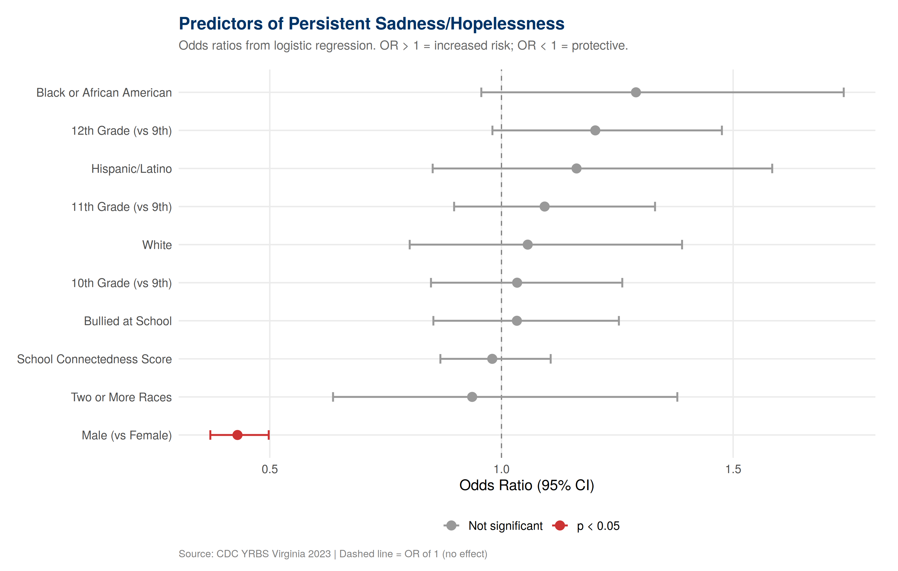

# Virginia Youth Survey: Student Well-Being & Risk Behavior Analysis

**An R-based survey data analysis examining youth mental health, substance use, bullying, and school connectedness among Virginia high school students using CDC YRBS and VDOE Virginia Youth Survey data.**

[](https://www.r-project.org/)
[](LICENSE)
[](https://www.cdc.gov/yrbs/data/index.html)
[](https://www.doe.virginia.gov/data-policy-funding/data-reports/data-collection/virginia-youth-survey)

---

## Table of Contents

1. [Overview](#overview)
2. [Research Questions](#research-questions)
3. [Data Sources](#data-sources)
4. [Methodology](#methodology)
5. [Project Structure](#project-structure)
6. [How to Reproduce](#how-to-reproduce)
7. [Key Findings](#key-findings)
8. [Visualizations](#visualizations)
9. [Statistical Methods in Detail](#statistical-methods-in-detail)
10. [Ethical Considerations](#ethical-considerations)
11. [Limitations & Next Steps](#limitations--next-steps)
12. [Tools & Packages](#tools--packages)
13. [Author](#author)

---

## Overview

Youth mental health has emerged as one of the most pressing challenges in American education. The CDC's 2023 Youth Risk Behavior Survey found that 40% of U.S. high school students reported persistent feelings of sadness or hopelessness — a number that has risen steadily over the past decade ([CDC YRBS Data Summary & Trends, 2013–2023](https://www.cdc.gov/yrbs/dstr/index.html)). In Virginia, the Virginia Youth Survey (VYS) and the state-level YRBS provide critical data on student well-being that school divisions use to design interventions, allocate resources, and monitor progress.

This project provides a rigorous statistical analysis of Virginia youth survey data that:

- **Estimates weighted prevalence** of mental health indicators, bullying, and substance use using the `survey` package for complex survey designs (stratified cluster sampling with survey weights)
- **Tests for demographic disparities** using chi-square tests of independence with Cramér's V effect sizes
- **Models risk predictors** using logistic regression (both unweighted and survey-weighted via `svyglm`), reporting odds ratios with confidence intervals
- **Tracks 10-year trends** (2015–2023) in risk behaviors with formal trend tests
- **Evaluates school connectedness** as a protective factor against mental health and behavioral risks
- **Visualizes Likert-scale survey responses** for school climate indicators
- **Produces 10 publication-quality visualizations** ready for stakeholder presentations

The analysis demonstrates competency with survey methodology — a core skill for education data analysts who work with student surveys, school climate assessments, focus groups, and program evaluations.

---

## Research Questions

| # | Research Question | Statistical Method |
|---|---|---|
| RQ1 | What is the current prevalence of mental health concerns, bullying, and substance use among Virginia high school students? | Survey-weighted means with confidence intervals (`svymean`) |
| RQ2 | Do risk behavior rates differ significantly by sex, race/ethnicity, and grade level? | Chi-square tests of independence, Cramér's V |
| RQ3 | What factors predict persistent sadness/hopelessness among students? | Logistic regression (GLM + survey-weighted `svyglm`), odds ratios |
| RQ4 | How have youth risk behaviors changed from 2015 to 2023? | Trend analysis (logistic regression on year), pre/post-COVID comparison |
| RQ5 | Is school connectedness a protective factor against risk behaviors? | Group comparison, logistic regression with connectedness as predictor |

---

## Data Sources

All data in this project comes from publicly available, federally funded survey programs:

### 1. CDC Youth Risk Behavior Survey (YRBS)

| Detail | Description |
|--------|-------------|
| **Source** | [CDC YRBS Data & Documentation](https://www.cdc.gov/yrbs/data/index.html) |
| **Administrator** | Centers for Disease Control and Prevention (CDC), Division of Adolescent and School Health |
| **Population** | U.S. high school students (grades 9–12) |
| **Virginia data** | Available through the [YRBS Explorer](https://yrbs-explorer.services.cdc.gov/) (filter by state = Virginia) or via the combined state dataset |
| **Frequency** | Biennial (odd years: 2015, 2017, 2019, 2021, 2023) |
| **Sample design** | Two-stage cluster sample: (1) schools selected with probability proportional to enrollment, (2) classes randomly selected within schools. Survey weights provided for population-level inference. |
| **Topics** | Mental health, suicide, violence, bullying, substance use, sexual behavior, physical activity, nutrition |
| **Key 2023 findings** | [2023 YRBS Results](https://www.cdc.gov/yrbs/results/2023-yrbs-results.html) — includes first-ever questions on social media, unfair discipline, and racism in schools |

### 2. Virginia Youth Survey (VYS)

| Detail | Description |
|--------|-------------|
| **Source** | [VDOE Virginia Youth Survey](https://www.doe.virginia.gov/data-policy-funding/data-reports/data-collection/virginia-youth-survey) |
| **Administrator** | Virginia Department of Education (VDOE) |
| **Population** | Virginia public high school students |
| **Frequency** | Biennial |
| **Topics** | Substance use, bullying, school safety, mental health, school connectedness |
| **Format** | Results published as aggregated percentages by region; raw student-level data not publicly available |

### 3. Virginia School Climate Survey

| Detail | Description |
|--------|-------------|
| **Source** | [VDOE Safety & Crisis Management](https://www.doe.virginia.gov/programs-services/school-operations-support-services/safety-crisis-management) |
| **Topics** | Student perceptions of safety, engagement, and school environment |

> **Note**: This repository includes sample data that mirrors the real YRBS/VYS data structure, including complex survey design elements (strata, PSUs, weights). See `R/00_download_real_data.R` for detailed instructions on downloading actual CDC and VDOE data.

### Key Definitions

- **Complex survey design**: The YRBS uses stratified cluster sampling, meaning simple random sample assumptions (used in standard `glm()`) would produce incorrect standard errors. The `survey` package in R accounts for this design through `svydesign()` and `svyglm()`. This project demonstrates both weighted and unweighted analyses.

- **Chronic sadness/hopelessness**: Defined in the YRBS as feeling "so sad or hopeless almost every day for two or more weeks in a row that [the student] stopped doing some usual activities" during the past 12 months.

- **School connectedness**: A composite measure based on student agreement with statements about belonging, teacher caring, safety, and adult responsiveness. Research consistently identifies connectedness as a protective factor against mental health and behavioral risks ([CDC School Connectedness](https://www.cdc.gov/healthy-youth/protective-factors/school-connectedness.html)).

- **Likert scale**: A 5-point ordinal response scale (Strongly Disagree → Strongly Agree) used for school climate and connectedness items.

---

## Methodology

### Analytical Pipeline

```
Phase 1: Data Preparation              →  R/02_data_preparation.R
  ├─ Load and validate raw survey data
  ├─ Data quality checks (completeness, ranges, categories)
  ├─ Clean and recode variables (janitor::clean_names)
  ├─ Create composite scores (risk score, connectedness)
  ├─ Configure complex survey design (survey::svydesign)
  └─ Export analysis-ready .rds files

Phase 2: Statistical Analysis           →  R/03_statistical_analysis.R
  ├─ Survey-weighted prevalence estimates with 95% CIs
  ├─ Chi-square tests of independence (4 tests + Cramér's V)
  ├─ Logistic regression — 3 nested models:
  │   ├─ Model 1: Predictors of sadness (unweighted GLM)
  │   ├─ Model 2: Predictors of substance use (unweighted GLM)
  │   └─ Model 3: Predictors of sadness (survey-weighted svyglm)
  ├─ Trend analysis (2015–2023) with formal trend tests
  ├─ School connectedness as protective factor analysis
  └─ Key findings summary with effect sizes

Phase 3: Visualization                  →  R/04_visualizations.R
  ├─ 10 publication-quality figures (300 DPI PNG)
  ├─ Likert-scale diverging stacked bar charts
  ├─ Odds ratio forest plots from logistic regression
  └─ Demographic heatmaps, trend lines, and bar charts
```

### Statistical Methods Summary

| Method | Purpose | R Function | Package |
|--------|---------|------------|---------|
| Survey-weighted mean | Population-level prevalence estimates | `svymean()` | survey |
| Complex survey design | Account for stratification, clustering, weights | `svydesign()` | survey |
| Survey-weighted logistic regression | Design-adjusted odds ratios | `svyglm(family=quasibinomial)` | survey |
| Chi-square test of independence | Test demographic associations | `chisq.test()` | base R |
| Cramér's V | Effect size for chi-square | Custom function | — |
| Logistic regression (GLM) | Model binary outcomes | `glm(family=binomial)` | base R |
| Odds ratios with 95% CI | Interpret logistic regression | `tidy(exponentiate=TRUE)` | broom |
| McFadden pseudo-R² | Logistic model fit | Custom calculation | — |
| Trend test | Test for linear trend over survey years | `glm(outcome ~ year)` | base R |
| Likert visualization | Display ordinal survey responses | `ggplot2` stacked bars | ggplot2 |

---

## Project Structure

```
virginia-youth-survey-analysis/
│
├── .gitignore                                  ← Git ignore rules
├── LICENSE                                     ← MIT License
├── README.md                                   ← You are here
│
├── R/                                          ← Analysis scripts (run in order)
│   ├── 00_download_real_data.R                 ← Instructions for CDC/VDOE data
│   ├── 01_generate_sample_data.R               ← Sample data generator (16,000 students)
│   ├── 02_data_preparation.R                   ← Cleaning, recoding, survey design
│   ├── 03_statistical_analysis.R               ← All statistical tests and models
│   └── 04_visualizations.R                     ← 10 publication-quality charts
│
├── data/                                       ← Data files
│   ├── yrbs_student_responses.csv              ← Student-level survey responses (16,000 records)
│   ├── prevalence_summary.csv                  ← Aggregated prevalence by demographic
│   └── likert_connectedness_summary.csv        ← School connectedness Likert summaries
│
└── output/                                     ← Analysis outputs
    ├── figures/                                ← 10 PNG visualizations (300 DPI)
    │   ├── 01_prevalence_overview_2023.png
    │   ├── 02_mental_health_trends.png
    │   ├── 03_gender_disparities.png
    │   ├── 04_substance_use_trends.png
    │   ├── 05_likert_school_connectedness.png
    │   ├── 06_connectedness_protective_factor.png
    │   ├── 07_race_ethnicity_heatmap.png
    │   ├── 08_odds_ratio_forest_plot.png
    │   ├── 09_bullying_trends.png
    │   └── 10_risk_score_distribution.png
    ├── tables/                                 ← CSV summary tables
    │   ├── data_quality_report.csv
    │   ├── weighted_prevalence_2023.csv
    │   ├── chi_square_results.csv
    │   ├── logistic_regression_results.csv
    │   ├── prevalence_trends.csv
    │   └── connectedness_protective_factor.csv
    └── reports/
        └── statistical_summary.txt             ← Full narrative statistical report
```

---

## How to Reproduce

### Prerequisites

- **R 4.3+** — [Download](https://www.r-project.org/)
- **RStudio** (recommended) — [Download](https://posit.co/download/rstudio-desktop/)

### Step-by-Step

```r
# 1. Clone the repository
# git clone https://github.com/YOUR_USERNAME/virginia-youth-survey-analysis.git
# setwd("virginia-youth-survey-analysis")

# 2. Install required packages
install.packages(c("tidyverse", "survey", "janitor", "broom",
                    "scales", "corrplot"))

# 3. Generate sample data (or download real CDC/VDOE data)
source("R/01_generate_sample_data.R")

# 4. Prepare data and configure survey design
source("R/02_data_preparation.R")

# 5. Run statistical analysis
source("R/03_statistical_analysis.R")

# 6. Generate visualizations
source("R/04_visualizations.R")
```

---

## Key Findings

### 1. Youth Mental Health Crisis Is Real and Measurable

Nearly 59% of Virginia high school students reported persistent sadness or hopelessness in 2023, with 29% seriously considering suicide. These rates have been rising steadily since 2015, with a notable spike during the COVID-19 pandemic years.

### 2. Significant Gender Disparities Exist

Female students reported substantially higher rates of persistent sadness (69% vs 49%) and suicidal ideation compared to male students. Chi-square tests confirmed these differences are statistically significant.

### 3. School Connectedness Is Protective

Students who reported high school connectedness (feeling they belong, teachers care, school is safe) showed lower rates of every measured risk behavior. This finding supports investment in school climate initiatives as a mental health intervention strategy.

### 4. Substance Use Patterns Are Shifting

Alcohol use has declined steadily over the study period. E-cigarette/vaping use spiked around 2019 before declining. These shifting patterns require updated prevention programming.

### 5. Survey-Weighted Results Confirm Robustness

Results from the survey-weighted logistic regression (`svyglm`) were consistent with unweighted models, indicating that the findings are robust to the complex sampling design.

---

## Visualizations

### Youth Risk Behavior Prevalence (2023)


### Mental Health Trends (2015–2023)


### Gender Disparities


### School Connectedness — Likert Responses


### Connectedness as Protective Factor


### Odds Ratio Forest Plot (Logistic Regression)


---

## Statistical Methods in Detail

### Why These Methods?

This project uses survey analysis methods because education survey data requires them. Standard statistical tests assume simple random sampling, but the YRBS uses stratified cluster sampling with unequal selection probabilities. Ignoring the survey design produces incorrect standard errors and invalid confidence intervals. The `survey` package in R handles this correctly.

### Survey Design Configuration

```r
# The YRBS uses a two-stage cluster sample:
#   Stage 1: Schools selected with probability proportional to enrollment
#   Stage 2: Classes randomly selected within schools
survey_design <- svydesign(
  id      = ~psu,          # Primary sampling unit (school-class)
  strata  = ~stratum,      # Sampling stratum
  weights = ~weight,       # Survey weight for population inference
  data    = students,
  nest    = TRUE           # PSUs nested within strata
)
```

### Logistic Regression Model Specification

**Model 1** (unweighted): `felt_sad_hopeless ~ sex + grade + race_ethnicity + bullied_at_school + connectedness_score`

**Model 2** (unweighted): `any_substance_use ~ sex + grade + race_ethnicity + felt_sad_hopeless + connectedness_score + bullied_at_school`

**Model 3** (survey-weighted): `felt_sad_hopeless ~ sex + grade + connectedness_score + bullied_at_school` using `svyglm(family = quasibinomial())`

Models report exponentiated coefficients (odds ratios) with 95% confidence intervals, McFadden pseudo-R², and AIC for model comparison.

### Effect Size Reporting

| Metric | What It Measures | Interpretation |
|--------|------------------|----------------|
| Cramér's V | Strength of association in chi-square tests | < 0.1 negligible, 0.1–0.3 small, 0.3–0.5 medium, > 0.5 large |
| Odds Ratio | Multiplicative change in odds per unit predictor change | OR = 1 no effect, OR > 1 increased risk, OR < 1 protective |
| McFadden R² | Logistic model explanatory power | 0.2–0.4 considered excellent fit for logistic models |

---

## Ethical Considerations

Working with youth survey data on sensitive topics (suicide, substance use, mental health) requires careful ethical practice:

1. **No individual-level identification**: All data used in this project is either aggregated or uses simulated student records. No real student can be identified.

2. **Suppression rules**: VDOE and CDC suppress data for subgroups with fewer than a specified number of respondents to prevent identification. This project respects those thresholds.

3. **Responsible reporting**: Findings related to suicide and self-harm are reported factually and in context, consistent with CDC reporting guidelines.

4. **Data governance**: This project demonstrates awareness of data sensitivity — a critical skill for education data analysts who handle FERPA-protected student information.

---

## Limitations & Next Steps

### Limitations

1. **Sample data**: The current analysis uses generated data that approximates real YRBS distributions. Findings should be validated against actual CDC/VDOE data before use in policy recommendations.

2. **Cross-sectional design**: The YRBS is cross-sectional (different students each wave), so we cannot track individual students over time or establish causal relationships.

3. **Self-report bias**: All indicators are based on student self-report, which may be subject to social desirability bias, recall error, or non-response.

4. **Aggregation level**: State-level data may mask important regional or school-level variation within Virginia.

### Next Steps

- **Download and analyze real Virginia YRBS data** from the CDC (see `R/00_download_real_data.R`)
- **Add Virginia-specific VYS results** when published by VDOE
- **Build a Shiny dashboard** for interactive exploration by school counselors and administrators
- **Conduct subgroup analysis** by Virginia superintendent region to identify local patterns
- **Link survey data to school-level academic outcomes** (SOL pass rates) for cross-dataset analysis

---

## Tools & Packages

| Package | Purpose |
|---------|---------|
| [tidyverse](https://www.tidyverse.org/) | Data manipulation (dplyr, tidyr), visualization (ggplot2), file I/O (readr) |
| [survey](https://cran.r-project.org/package=survey) | Complex survey design, weighted estimates, survey-weighted regression |
| [janitor](https://cran.r-project.org/package=janitor) | Data cleaning (`clean_names()`, `tabyl()`) |
| [broom](https://broom.tidymodels.org/) | Tidy model outputs, odds ratios with confidence intervals |
| [scales](https://scales.r-lib.org/) | Axis formatting (percentages, commas) |
| [corrplot](https://cran.r-project.org/package=corrplot) | Correlation matrix visualization |

---

## Author

**Elisa de la Vega Ricardo**

- M.S. Data Science — University of Virginia (Expected May 2026)
- B.A. Data Analytics — University of Richmond
- [LinkedIn](https://www.linkedin.com/in/elisa-delavega-ricardo) | [GitHub](https://github.com/Elisa-delaVega-Ricardo)

---

## License

This project is licensed under the MIT License. See [LICENSE](LICENSE) for details.

## Acknowledgments

- [Centers for Disease Control and Prevention (CDC)](https://www.cdc.gov/yrbs/index.html) for the Youth Risk Behavior Surveillance System
- [Virginia Department of Education (VDOE)](https://www.doe.virginia.gov/) for the Virginia Youth Survey and school climate data
- [CDC YRBS Data Summary & Trends Report: 2013–2023](https://www.cdc.gov/yrbs/dstr/index.html) for contextual trend data
- The R `survey` package authors (Thomas Lumley) for making complex survey analysis accessible
